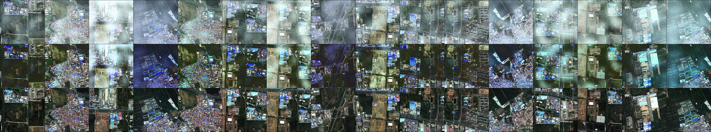

# Dehazing of Satellite Images using Deep Learning
Images captured in hazy weather conditions can be degraded by scattering of atmospheric particles which changes the color, and makes the object features difficult to identify by human vision and by some outdoor computer vision systems. Visibility and contrast of the scene is highly affected by atmospheric factors. Fog or Haze decreases the clarity of satellite images. Hence image dehazing plays an important role in removing the influence of weather factors in order to improve the quality of image.

Image dehazing is the process of scenically improving the degraded visibility caused by atmospheric conditions. Our aim is to restore the scene radiance from the hazy image. Several methods have been proposed to improve the quality of hazy images, including estimating the transmission function based on a linear model, using deep learning techniques, and incorporating boundary constraint and contextual regularization. 

***

# Getting Started
1. Run the `scripts/setup_dataset.py` python script to download and set up the dataset.
2. Discover the jupyter notebooks

# Dataset Information
The dataset consists of Multispectral Satellite Images captured by an ISRO satellite.
 
Training Images -> 960
 
Testing Images -> 135
 
Validation Images -> 105

# Methods implemented
1. AODnet
2. DCP
3. Resnet (Work in Progress)

# Observations

*Output using AODnet with SSIM loss for 10 epochs with Adam optimizer*